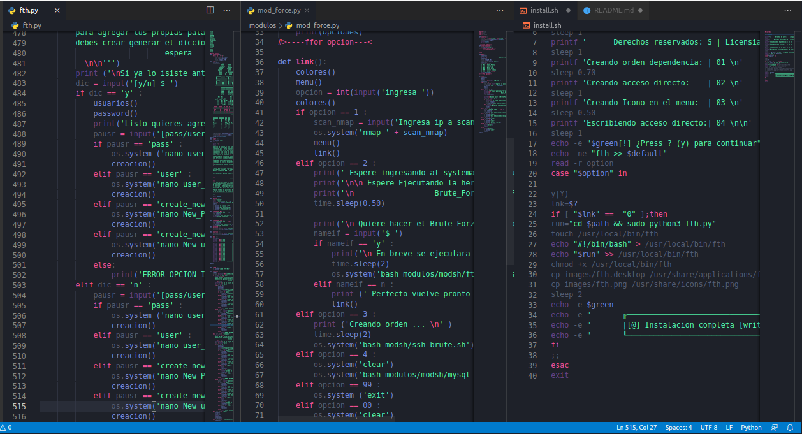

 

 

 
<li><a href="https://github.com/anonymous-sys19">Mi perfil</a></li>
<li><a href="images/video.mkv">Video</a></li>
<li><a href="https://github.com/anonymous-sys19?tab=repositories">Mis repositorios</a></li>
<li><a href="https://www.facebook.com/greivin.mayorga.5">RED_SOCIAL</a></li>

 
  

 

  

  

 
 
  

 

#                                   Caracteristicas:

* Desarrollo de codigo abierto
* Desarrollado en Python
* Version 2.0
* interacciondel systema
* Enfocado para uso principiante y profecional

##                                   Instalación: 
 
bash  

  # Actualizar su lista de paquetes 
    $ sudo apt update && apt upgrade
    
  # Clonar el repositorio  
    $ git clone https://github.com/anonymous-sys19/fthv2
    
  # Entre al repositorio 
    $ cd fthv2
    
  # Inicar 
    $ bash install.sh
    
  # si no es esta en usuario root 
    $ sudo bash install.sh
  
  # Podra ejecutar desde el menu o escribiendo 
    $fth
    
    

## Video 

<h4 align='center'>LINK/ENLACE:</h4>
 

 
 
# Que es fthv2 #*

 fth es una herramienta diseñada y pensada para aquellas personas que enpiensan en el mundo de la informatica, donde podras llevar a cabo trabajos del entorno linux 
como el uso de la herramienta y sus modulos agregados.
como lo eh mencionado se puede interactuar con las herramientas del systema [/usr/bin]
los modulos bases son basicos  como [Fuerza bruta a puertos ; ssh, ftp, mysql, :]
por otro lado, agrege  la interaccion de crear payloads automatizados.
como principio solo contiene [1 android :[1 windows]]
tambien contiene una herramienta ya existente que esta disponible en mi github llamada [Hacker]
Si deceas ver el uso te dejo el <a href="images/video.mkv"> link </a> 
 
 

 
                            

ESPERO LES GUSTE 

 ## Imagenes  

 

--------------------------------------------------------------------------------------- 

 

--------------------------------------------------------------------------------------- 

 

--------------------------------------------------------------------------------------- 

 

 

fth License 

Copyright (c) 2021 anonymous-sys19 

Permission is hereby granted, free of charge, to any person obtaining a copy 
of this software and associated documentation files (the "Software"), to deal 
in the Software without restriction, including without limitation the rights 
to use, copy, modify, merge, publish, distribute, sublicense, and/or sell 
copies of the Software, and to permit persons to whom the Software is 
furnished to do so, subject to the following conditions: 
 
The above copyright notice and this permission notice shall be included in all 
copies or substantial portions of the Software. 
 
THE SOFTWARE IS PROVIDED "AS IS", WITHOUT WARRANTY OF ANY KIND, EXPRESS OR 
IMPLIED, INCLUDING BUT NOT LIMITED TO THE WARRANTIES OF MERCHANTABILITY, 
FITNESS FOR A PARTICULAR PURPOSE AND NONINFRINGEMENT. IN NO EVENT SHALL THE 
AUTHORS OR COPYRIGHT HOLDERS BE LIABLE FOR ANY CLAIM, DAMAGES OR OTHER 
LIABILITY, WHETHER IN AN ACTION OF CONTRACT, TORT OR OTHERWISE, ARISING FROM, 
OUT OF OR IN CONNECTION WITH THE SOFTWARE OR THE USE OR OTHER DEALINGS IN THE 
SOFTWARE. 
 
 

Copyright (c) 2021 by hacker-pc 
